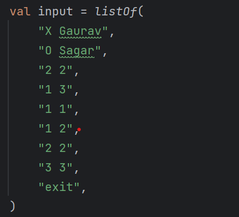
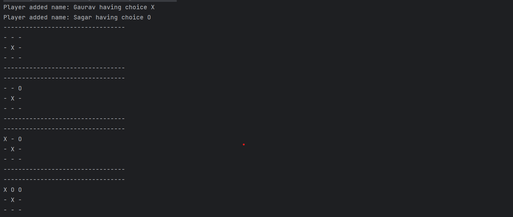
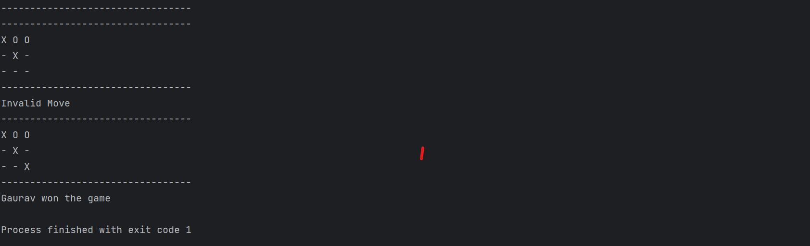

# Tic Tac Toe

This is the solution to question

https://workat.tech/machine-coding/practice/design-tic-tac-toe-smyfi9x064ry

It satisfies all the requirement mentioned in the problem statement of it

## Rules of the game
1. The game starts with an empty grid.
2. The game is played between two players. One player owns the X pieces and can put it on any of the empty cells in the grid. The other player owns the O pieces and can in any of the empty cells. 
3. The player with X makes the first turn. Each player plays alternately after that. 
4. The first player to form a horizontal/vertical/diagonal sequence wins.

## Requirement
1. Ask the user for the names of the two players
2. Print the grid after initializing
3. Allow the user to make moves on behalf of both the players. 
   * The user will make a move by entering the cell position. 
   * You need to determine the piece (X/O) and make the move if it is valid. 
   * Valid move: 
     * The piece is controlled by the player having the current turn
     * The cell is empty 
   * If the move is invalid
     * print 'Invalid Move'
     * the same player plays again
   * If the move is valid: 
     * put the piece on the cell 
     * print the board after the move 
4. Determine if a player has won or if there are no valid moves left. Ignore all moves mentioned after that.

Test input

Output

